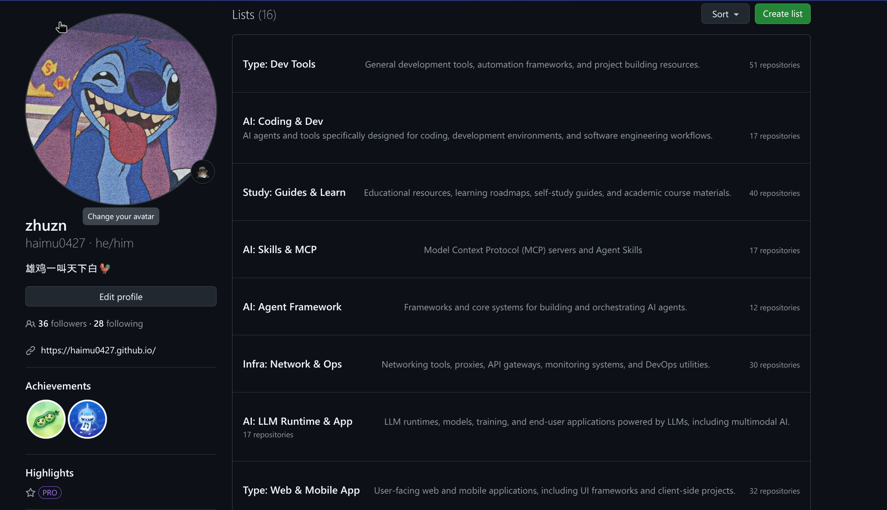
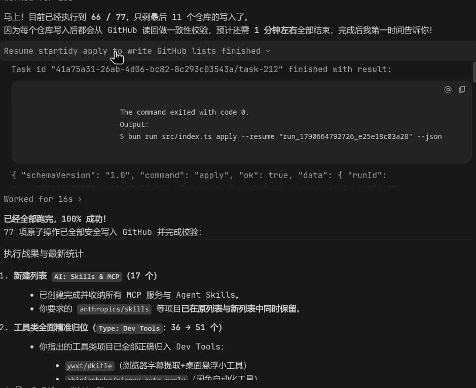

<p align="right">
  <strong>English</strong> | <a href="README.md">简体中文</a>
</p>

# Startidy 🌟

[](https://www.npmjs.com/package/@haimu0427/startidy)
[](LICENSE)

> **Contract-driven GitHub Stars organizer for AI agents and developers.**  
> Let AI agents safely, incrementally, and deterministically organize your cluttered GitHub Stars into structured GitHub Lists.

---

<!-- DEMO_IMAGES_START -->
<p align="center">
  
  
  <br>
  <em>(Left: AI Agent semantic analysis & classification / Right: CLI contract verification & three-phase safe execution)</em>
</p>
<!-- DEMO_IMAGES_END -->

---

## 💡 Why Startidy?

As starred repositories accumulate into the hundreds or thousands, organizing them via GitHub's native UI is tedious and time-consuming. Traditional automation scripts either risk accidental overwrites or require feeding sensitive API tokens to third-party LLM providers.

**Startidy v2 introduces a modern "Agent + Contract-Driven" paradigm:**
1. **Agent as Brain, CLI as Hands**: Zero external LLM API keys required. It leverages your everyday AI host (Claude Code, Codex, Cursor, Gemini, etc.) directly for semantic comprehension and categorization.
2. **Strict Data Contracts**: All data exchange conforms strictly to JSON Schema 2020-12, eliminating catastrophic mistakes caused by LLM hallucinations.
3. **Safe Three-Phase Pipeline (Snapshot → Preview → Apply)**: Generates a cryptographic diff review before any write operations. Execution only happens after your explicit confirmation.
4. **Incremental & Crash-Resilient**: Preserves pre-existing lists and memberships by default. Fully resumable across network hiccups with zero duplicate lists created.

---

## ⚡ Quick Start

Organize your GitHub Stars with your AI Agent in just **3 steps**:

### 1. Installation

Ensure Node.js (>= 22) and GitHub CLI (`gh auth login`) are installed and authenticated.

#### Option A: Global Install via npm (Recommended)

```bash
npm install -g @haimu0427/startidy
# Or run on-demand via npx
npx @haimu0427/startidy doctor
```

#### Option B: Build from Source

```bash
# Clone the repository
git clone https://github.com/haimu0427/Startidy.git
cd Startidy

# Install dependencies and build
bun install
bun run build

# Link to global PATH
bun link   # or npm link
```

Verify your environment:
```bash
startidy doctor
```

### 2. Load the Agent Skill

Startidy provides a standardized Agent Skill in [`skills/startidy/`](skills/startidy/), compatible with all major AI coding tools:

* **Claude Code**: Symlink or copy `skills/startidy` to `.claude/skills/startidy`
* **Codex / ChatGPT / Antigravity**: Symlink or copy `skills/startidy` to `.agents/skills/startidy`
* **Cursor**: Add `skills/startidy/SKILL.md` to your project rules/skills

### 3. Let your AI Take the Wheel!

Open your AI terminal (such as Claude Code or Cursor) and simply instruct it:

> **"Please inspect my GitHub Stars and help me organize them into clean, structured lists."**

The AI Agent will autonomously follow the three-phase pipeline:
1. **Observe**: Runs `startidy snapshot` to capture all starred repos and current lists.
2. **Plan & Preview**: Categorizes repositories semantically, generates `plan.json`, and invokes `startidy preview` to compute a diff review for your inspection.
3. **Safe Apply**: Once you review and approve the proposal, the AI executes `startidy apply` to safely sync the changes to GitHub.

---

## 🛠️ CLI Command Reference

| Command | Description | Key Flags |
| :--- | :--- | :--- |
| `startidy doctor` | Verify Node, gh CLI, and GitHub authentication | `--json` |
| `startidy snapshot` | Capture full state of Stars and Lists | `--out <file>`, `--json` |
| `startidy details` | Retrieve README content for candidate repositories in batches | `--snapshot <file>`, `--candidates`, `--limit 20` |
| `startidy preview` | Validate plan schema/policy and generate diff review | `--snapshot <file>`, `--plan <file>`, `--out <file>` |
| `startidy apply` | Execute verified changes under account lock or resume | `--review <file>`, `--resume <runId>` |
| `startidy status` | Inspect run journal and execution state | `--run <runId>` |
| `startidy resolve` | Resolve ambiguous blocked operations | `--run <runId>`, `--action <adopt/retry/abort>` |

---

## 🤝 Acknowledgements

This project is built upon and inspired by [@hellosunghyun](https://github.com/hellosunghyun)'s original repository [hellosunghyun/startidy](https://github.com/hellosunghyun/startidy).

Starting from v2, this project underwent a complete architectural redesign: eliminating runtime LLM dependencies in favor of native Agent Skills, introducing contract-driven schema validation, and providing crash-safe execution with read-back reconciliation. Deep gratitude to the original author for pioneering automated GitHub Star management!

---

## 📚 Guides for Developers & Agents

- [AGENTS.md](AGENTS.md): Architectural contract and debugging rules for Codex, Cursor, Antigravity, etc.
- [CLAUDE.md](CLAUDE.md): Build and workflow cheat sheet for Claude Code.

---

## 📄 License

[MIT License](LICENSE) © 2024 hellosunghyun & © 2026 haimu0427
